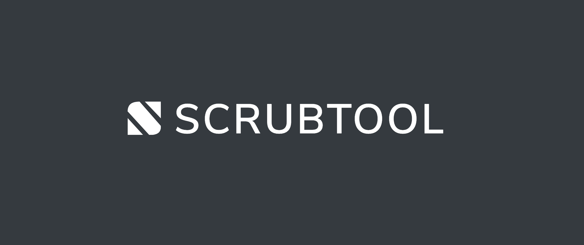

Professionally utilize lead suppression lists.

## Main Features

* *Scrub*: Remove records from your file that match one or more suppression list/s.
* *List*: Create and manage your suppression list (DNE/DNC) for you (or others) to use. Supports plain-text and all popular hash algorithms.
* *Hash*: Generate a hashed file to be used for scrubbing in other systems.

## Requirements

* PHP 7.3
* MySQL 5.7
* Laravel Nova license token (for the administrative interface)

### Local Development

    composer install
    npm install
    npm run watch &
    php artisan migrate
    php artisan queue:work --queue=analyze,run,build,delete &
    php artisan serve

### Queues Explained

* *analyze*: Analyzes files right after upload.
* *run*: Imports files, scrubs them, hashes them, generates exports.
* *build*: Takes plain text suppression lists and builds support for hashed equivalents.
* *delete*: Purges uploaded files after the allowed download window has passed.
